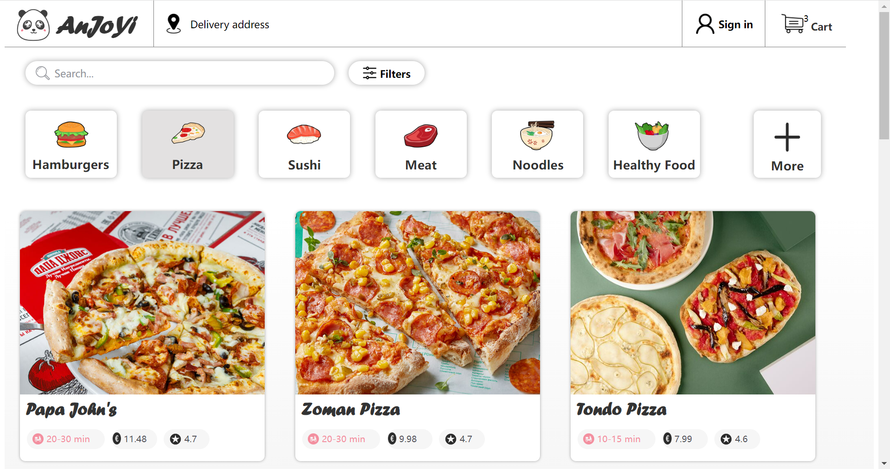
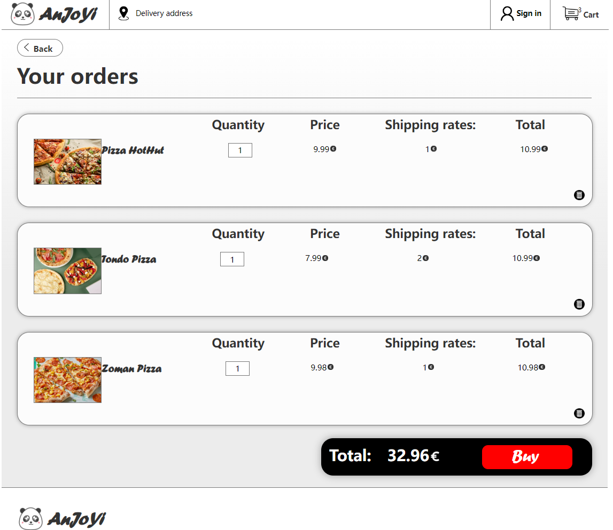

# DOM_PJ

# Description
This is a simple e-commerce based sample project that I have created. You can click on the product details view on the home page to add items to your shopping cart and calculate prices.

# The applied technologies

## Front End

- **JavaScript**
- **HTML**
- **CSS**

# Features

- Add product to shopping cart from product detail view or product list view
- Show correct sum of price of the items in shopping cart
- Add and remove products from shopping cart in shopping cart view and update the price information accordingly
- Products in shopping cart should be kept even if the user changes views
- Product information is loaded from a data array instead of hardcoded HTML
  
# Usage
Clone my code repository and open index-Pizzapage.html
  
